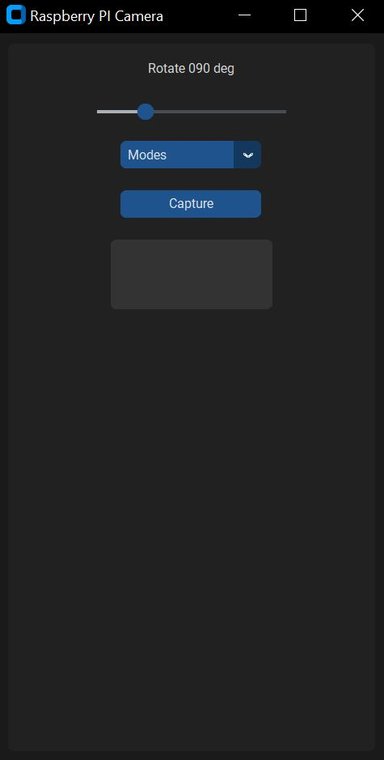
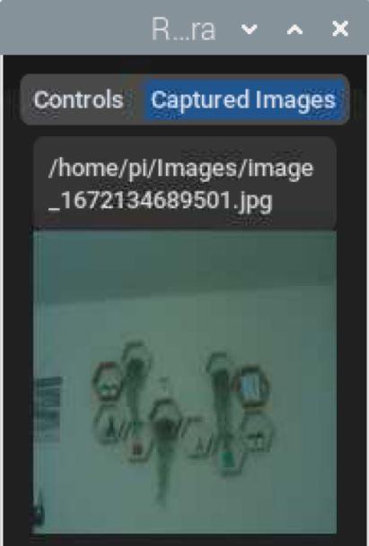

# Raspberry Pi Camera App
## Description
This Python `tkinter` app provides some of the camera options provided by Raspberry Pi camera module `raspistill`. So far this app only captures still images. Video capabilities may be supported in future.

## raspistill command help
Please check file [raspistill-help](raspistill-help)

## customtkinter repository
https://github.com/TomSchimansky/CustomTkinter

## Dependencies
- The Raspberry Pi camera should be installed and enabled
- The Raspberry Pi should be connected to a monitor
- Python 3.7+
- Python modules: customtkinter, Pillow

## Starting Raspberry Pi Camera App
- Open a command prompt in Raspberry PI and execute:  
`python3 rpi_camera.py`
- If you just want to test the app in your computer (not RaspBerry PI) or in a RaspBerry PI without a camera, execute:  
`python3 rpi_camera.py test`  
This will allow you to explore some basic features of the app while keeping in mins that many setting changes may not work in this mode

## Features
- After the app opens, it starts camera preview
- You can adjust camera rotation and also select different modes
- Furthermore, you can adjust brightness, sharpness, contrast and saturation of the image from the app
- When you change any of the settings, the preview gets automatically refreshed
- When satisfied, click on `(Capture Image)` button and the image will be captured
- The image path will be displayed in the status box in `[Captured Image]` tab (default path: ~/Images). You can adjust this path by clicking `(Save Location)` button in the app
- The captured image will be displayed in `[Captured Image]` tab. Note: in order to view the actual image, maximize/minimize/format it, you need to visit the image save location and open the image from there. The `[Captured Image]` tab only shows a quick preview of the captured image
- This app also allows you to run a test/demo version without needing a Raspberry PI or Raspberry PI camera. Check `Starting Raspberry Pi Camera App` for details

## Screenshots
* Note: The screenshots may not be up to date. The latest app may look different from the images captured below  
* Raspberry Pi camera app controls  
    
* Captured image by the app   
    

## Releases
|Release|Date|Features|
|-------|----|--------|
|0.0.1|Dec 26, 2022|Initial Release|
|0.0.2|Dec 27, 2022|Added current image view inside the app; rounded buttons; allowed ability to select image save location; removed padding from rotation text; changed rotation element UI type; added new elements for brightness, sharpness, contrast, saturation; divided elements into two tabs|
|0.0.3|Dec 28, 2022|Added ability to extend the camera module to add new modules as necessary; Added ability to run a demo version of the app without Raspberry PI or camera|