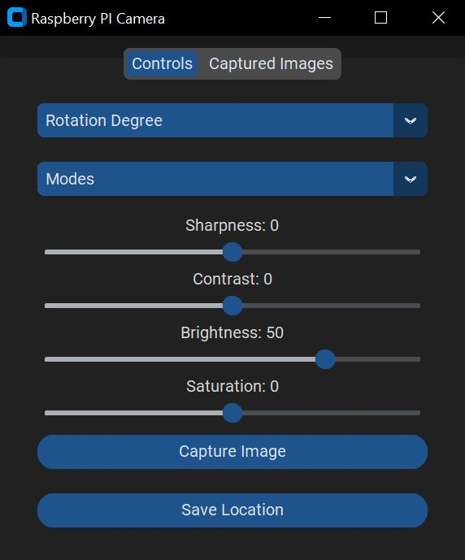

# Raspberry Pi Camera App
## Description
This Python `tkinter` app provides some of the camera options provided by Raspberry Pi camera module `raspistill`. So far this app only captures still image. Video capabilities may be supported in future.

## raspistill command help
Please check file [raspistill-help](raspistill-help)

## customtkinter repository
https://github.com/TomSchimansky/CustomTkinter

## Dependencies
- The Raspberry Pi camera should be installed and enabled
- The Raspberry Pi should be connected to a monitor
- Python 3.7+
- Python modules: customtkinter, Pillow

## Starting Raspberry Pi Camera App
- Open a command prompt in Raspberry PI and execute:
`python3 rpi_camera.py`

## Features
- After the app opens, it starts camera preview
- You can adjust camera rotation and also select different modes
- When you camera rotation and/or mode, the preview gets automatically refreshed
- When satisfied, click on [Capture] button and the image will be captured
- The image path will be displayed in the status box (default path: ~/Images). You can adjust this path in code
- The captured image will be displayed at the bottom of the app
- Also, you can adjust the default camera angle in code

## Screenshots

## Releases
|Release|Date|Features|
|-------|----|--------|
|0.0.1|Dec 26, 2022|Initial Release|
|0.0.2|Dec 27, 2022|Added current image view inside the app|